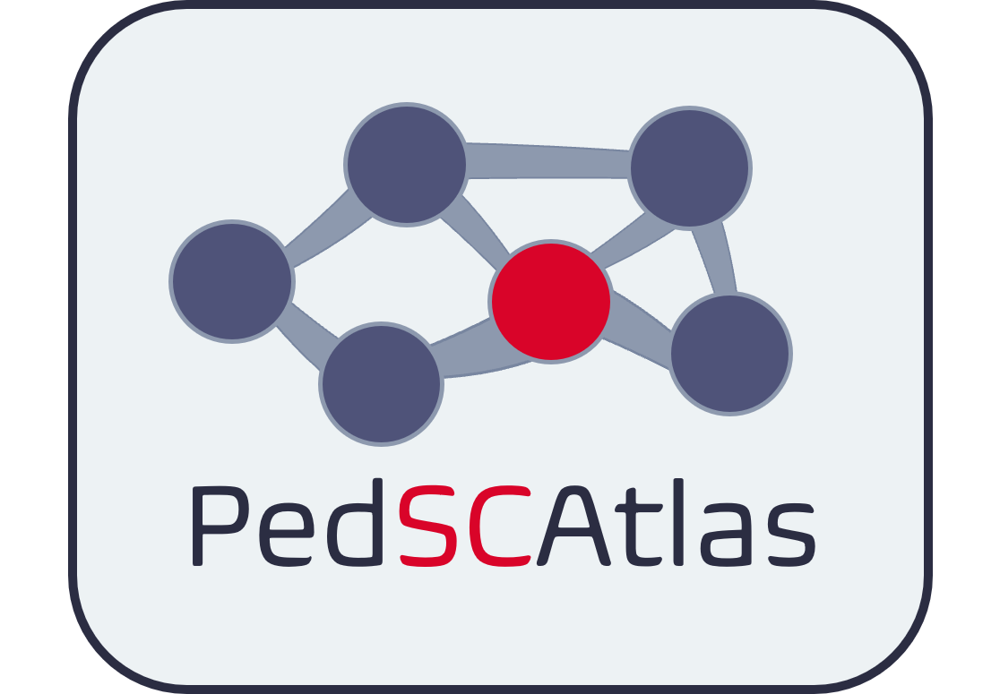

# PedSCAtlas
Welcome to the Github Page for the **Ped**iatric **S**ingle **C**ell Cancer **Atlas** (PedSCAtlas)!

Please post any issues or questions in the [Issues](https://github.com/bhasin-lab/PedSCAtlas/issues) section.

You can visit the **PedSCAtlas** and start your analysis at this link: [https://bhasinlab.bmi.emory.edu/PediatricSC/](https://bhasinlab.bmi.emory.edu/PediatricSCAtlas/)

## About

The **PedSCAtlas** was developed by the [Bhasin Systems Biomedicine Lab at Emory University](http://www.bhasinlab.org/) in collaboration with the [Aflac Cancer & Blood Disorders Center at Children's Healthcare of Atlanta](https://www.choa.org/medical-services/cancer-and-blood-disorders). The atlas allows for quick exploration, visualization of gene expression, and marker testing for different pediatric acute leukemia types without requiring extensive and time-consuming bioinformatics analysis and computational support. The web resource source code is written in python programming language and the interactive webserver has been implemented using python dash packages. The PedSCAtlas currently houses leukemia/bone marrow datasets, but we have plans to expand to different blood/solid cancers in the future.

You can learn more about the datasets included in the **PedSCAtlas** and learn how to use the tool in the following sections.

## Guide

Visit the tool and enter your email, affiliation, and country on the home page to get started.

*Note*: All plots generated on the web portal are *plotly* figures, meaning they can be interacted with. See the *plotly* [docs](https://dash.plotly.com/minimal-app) for more information. 

### 1. Analysis Module

#### 1.1 Metadata UMAP

The Acute Leukemia dataset contains the scRNA-seq data from over 70 pediatric patients diagnosed with a subtype of acute leukemia. The fourth row, Single-Cell Gene Expression in Healthy Tissue shows a separate dataset of almost 400,000 bone marrow cells from adult healthy donors for comparison.

You can view the cells contained in the Acute Leukemia dataset on a UMAP, and group the cells in terms of different metadata, in the ***METADATA UMAP*** panel. Options to group cells by include: Cell Type, Diagnosis (or disease group), Sample Id, Time Point, Source (repository), and more.

The figure below shows the ***METADATA UMAP*** panel, with "Cell Type" chosen. The checkboxes on the left can be clicked and un-clicked to include different combinations of data in the plot. Every time a parameter is adjusted, the plot is re-generated.

#### 1.2 Cell Type Proportions

To view the assigned cell type proportions for the acute leukemia dataset, access the ***CELL TYPE PROPORTIONS*** panel. You have the option of viewing the proportions for different disease groups (Diagnosis), samples, (Sample Id), or clusters (Cluster), and whether to show the actual raw counts of cells for each group or the proportion of cells assigned to a cell type out of all cells for the group.

#### 1.3 Single-Cell Gene Expression in Cancer

For the Acute Leukemia dataset, view the expression of a chosen gene in different cell groups (same as in Metadata UMAP section) through the ***SINGLE-CELL GENE EXPRESSION IN CANCER*** panel. You have the option of generating a violin plot, box-plot, or feature plot.

Below is a generated Violin plot for *PTEN* expression, grouped by Cell Type.

#### 1.4 Single-Cell Gene Expression in Healthy Tissue

Finally, through the ***SINGLE-CELL GENE EXPRESSION IN HEALTHY TISSUE*** panel, view the expression of a gene of your choice in the almost 400k cell healthy BM dataset. You have the option of chosing to group the data by *broad* or *fine* cell type labels.

### 2. Differential Expression Module

### 3. Marker Testing Module

## Cite Us

If you utilize our tool, please cite us! You can link to the tool's home page and cite our *Blood* abstract, from the American Society of Hematology Conference (2022). A full manuscript is currently under review. 

*Note*: our web page link has changed since the 2022 abstract.

> Hope L Mumme, Swati S Bhasin, Mariam Nawaz, Beena E Thomas, Chenbin Huang, Deborah DeRyckere, Sharon M. Castellino, Daniel S. Wechsler, Sunil S. Raikar, Christopher C. Porter, Douglas K Graham, Manoj Bhasin; A  Single Cell Atlas and Interactive Web-Resource of Pediatric Cancers and Healthy Bone Marrow. Blood 2022; 140 (Supplement 1): 2278–2279. doi: https://doi.org/10.1182/blood-2022-169153
