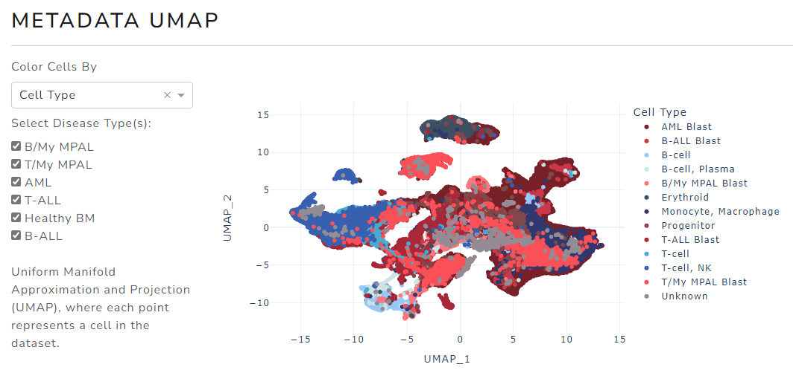
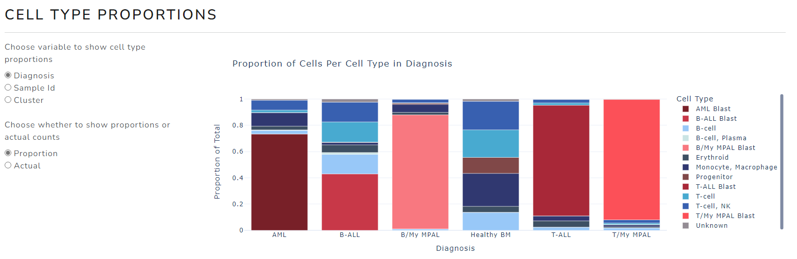
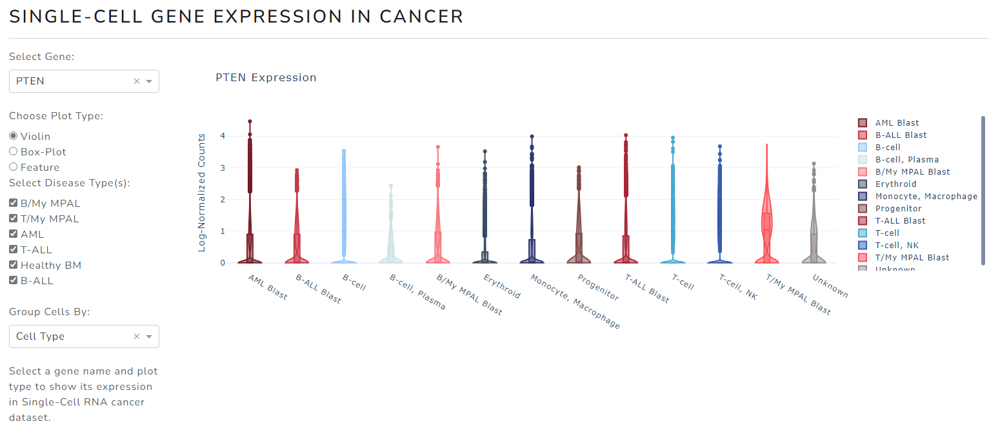
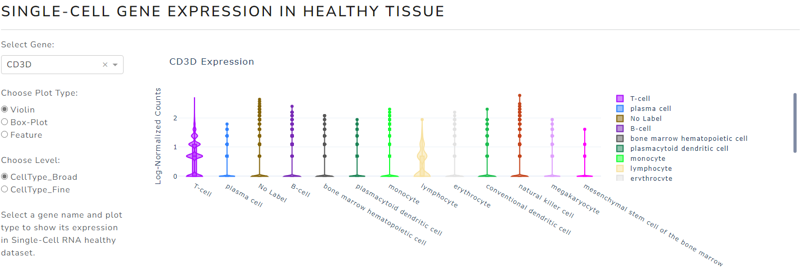
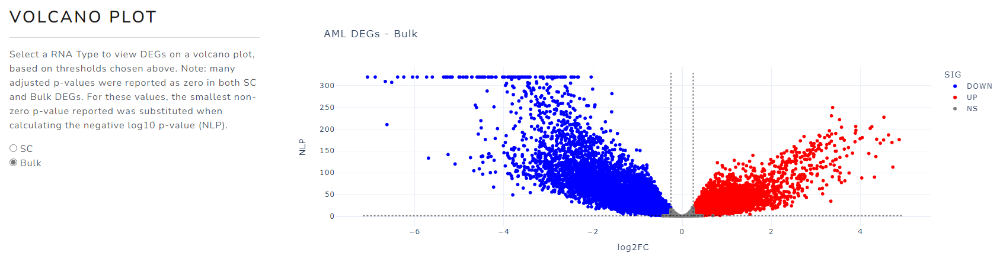
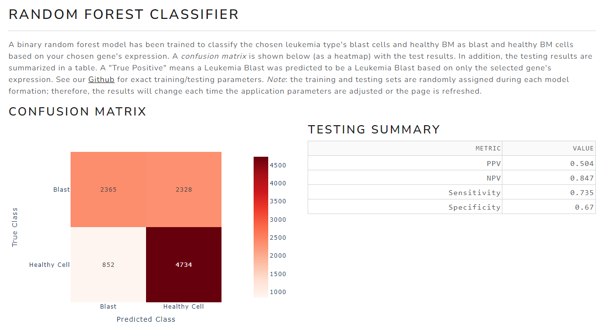

# PedSCAtlas 
Welcome to the Github Page for the **Ped**iatric **S**ingle **C**ell Cancer **Atlas** (PedSCAtlas)!

Please post any issues or questions in the [Issues](https://github.com/bhasin-lab/PedSCAtlas/issues) section.

You can visit the **PedSCAtlas** and start your analysis at this link: [https://bhasinlab.bmi.emory.edu/PediatricSCAtlas/](https://bhasinlab.bmi.emory.edu/PediatricSCAtlas/)

## About

The **PedSCAtlas** was developed by the [Bhasin Systems Biomedicine Lab at Emory University](http://www.bhasinlab.org/) in collaboration with the [Aflac Cancer & Blood Disorders Center at Children's Healthcare of Atlanta](https://www.choa.org/medical-services/cancer-and-blood-disorders). The atlas allows for quick exploration, visualization of gene expression, and marker testing for different pediatric acute leukemia types without requiring extensive and time-consuming bioinformatics analysis and computational support. The web resource source code is written in python programming language and the interactive webserver has been implemented using python dash packages. The PedSCAtlas currently houses leukemia/bone marrow datasets, but we have plans to expand to different blood/solid cancers in the future.

You can learn more about the datasets included in the **PedSCAtlas** and learn how to use the tool in the following sections.

## Guide

Visit the tool and enter your email, affiliation, and country on the home page to get started.

*Note*: All plots generated on the web portal are *plotly* figures, meaning they can be interacted with. See the *plotly* [docs](https://dash.plotly.com/minimal-app) for more information. 

### 1. Analysis Module

#### 1.1 Metadata UMAP

The Acute Leukemia dataset contains the scRNA-seq data from over 70 pediatric patients diagnosed with a subtype of acute leukemia. The fourth row, Single-Cell Gene Expression in Healthy Tissue shows a separate dataset of almost 400,000 bone marrow cells from adult healthy donors for comparison.

You can view the cells contained in the Acute Leukemia dataset on a UMAP, and group the cells in terms of different metadata, in the ***METADATA UMAP*** panel. Options to group cells by include: Cell Type, Diagnosis (or disease group), Sample Id, Time Point, Source (repository), and more.

The figure below shows the ***METADATA UMAP*** panel, with "Cell Type" chosen. The checkboxes on the left can be clicked and un-clicked to include different combinations of data in the plot. Every time a parameter is adjusted, the plot is re-generated.

#### 1.2 Cell Type Proportions

To view the assigned cell type proportions for the acute leukemia dataset, access the ***CELL TYPE PROPORTIONS*** panel. You have the option of viewing the proportions for different disease groups (Diagnosis), samples, (Sample Id), or clusters (Cluster), and whether to show the actual raw counts of cells for each group or the proportion of cells assigned to a cell type out of all cells for the group.

#### 1.3 Single-Cell Gene Expression in Cancer

For the Acute Leukemia dataset, view the expression of a chosen gene in different cell groups (same as in Metadata UMAP section) through the ***SINGLE-CELL GENE EXPRESSION IN CANCER*** panel. You have the option of generating a violin plot, box-plot, or feature plot.

Below is a generated Violin plot for *PTEN* expression, grouped by Cell Type.

#### 1.4 Single-Cell Gene Expression in Healthy Tissue

Finally, through the ***SINGLE-CELL GENE EXPRESSION IN HEALTHY TISSUE*** panel, view the expression of a gene of your choice in the almost 400k cell healthy BM dataset. You have the option of chosing to group the data by *broad* or *fine* cell type labels.

### 2. Differential Expression Module

In our upcoming publication, multiple differential expression (DE) tests were performed to identify a pan-leukemia signature. We compare malignant (blast) leukemia cells with healthy BM cells in each leukemia type, along with performing a similar comparison using the TARGET-AML, TARGET-ALL-P2, and TARGET-ALL-P3 Bulk RNA-seq datasets from the GDC. 

On the *DE* page, you are able to sort through the results of these different tests. 

See below for a description of the DE methodology:
- SC - *Seurat's* `FindMarkers` was used to identify over-expressed (log2FC>0.25, adjusted p-value < 0.05) in a leukemia type's (e.g. AML) blast cells when compared to healthy BM cells
- Bulk -  *edgeR's* `lmfit`, `makeContrasts`, and `eBayes` functions were used to compare *primary BM* from a leukemia subtype and *normal BM* to identify over-expressed genes.
- When calculating the negative log10 p-value (NLP), adjustments had to be made due to some adjusted p-values being reported as zero. In these cases, the minimum non-zero value was used for the NLP.

*Note*: We will have a complete, thorough description of the methodlogy in our upcoming paper.

In the ***CHOOSE A DISEASE TYPE*** panel, select a leukemia type and DE parameters. This will update the corresponding table in the ***DEGS*** panel and the plot in the ***VOLCANO PLOT*** panel according to your parameters.

Below is a volcano plot from the AML Bulk DE results. On DE page, you can hover over points to view gene names and specific metrics.

### 3. Marker Testing Module

The *PedSCAtlas* contains a unique feature that allows users to test their genes of interest as potential markers of a leukemia subtype. After inputting a gene and leukemia type of interest, the *MARKER TESTING* module page will update three panels with different metrics that assess the biomarker potential of a gene.

The first panel, ***DIFFERENTIAL EXPRESSION TESTING*** reports the DE results for the chosen gene, similar to the results presented in the *DE* page.

The second panel, ***RANDOM FOREST CLASSIFIER*** generates a *confusion matrix* and a *testing summary* for the random forest classifier trained and tested based on expression of the chosen gene to classify cells as blast or healthy. The chosen leukemia type cells and cells from healthy donors are pulled from the over 230k cell Acute Leukemia dataset. These cells are sorted into "blast" and "healthy cell" classes. A 70/30 training/test split is used to separate the data into a training and testing pool. 

*Note*: the training and testing sets are randomly assigned during each model formation; therefore, the results will change each time the application parameters are adjusted or the page is refreshed.

The figure belows shows the testing results for a classifer trained to differentiate T/My MPAL blasts from healthy cells based on only *PTEN* expression.

## Cite Us

If you utilize our tool, please [cite](https://www.nature.com/articles/s41467-025-59362-5#citeas) our 2025 *Nature Communications* publication!

> Mumme, H.L., Huang, C., Ohlstrom, D. et al. Identification of leukemia-enriched signature through the development of a comprehensive pediatric single-cell atlas. Nat Commun 16, 4114 (2025). https://doi.org/10.1038/s41467-025-59362-5

